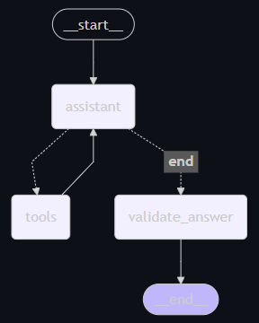

# LangGraph AI Agent - Hugging Face Agent Course Final Project

This project is the final hands-on challenge of the Hugging Face Agents Course. The mission: create a sophisticated AI agent capable of tackling real-world tasks from the GAIA benchmark - a rigorous evaluation framework designed to test AI assistants on complex scenarios requiring reasoning, multimodal understanding, web browsing, and advanced tool use.

This LangGraph-based agent is engineered to excel on a curated subset of 20 Level 1 validation questions from GAIA. The project features a sophisticated conversational AI agent built with LangGraph, providing intelligent responses through multiple specialized tools and models. 

## The Dataset: GAIA

Uses a set of 20 questions selected from the Level 1 validation set of GAIA

## Agent Architecture

## Model Selection

Hybrid model strategy to optimize performance, cost-efficiency, and reliability:

1. `gemini-2.0-flash` is the primary assistant and tool-calling model. As a multimodal model, it handles both text, audio and visual inputs, making it ideal for data analysis involving structured or visual data. Accessed via the Google API with a generous free tier, it offers powerful, fast, and cost-effective performance for high-level reasoning and tool interactions.

2. `gemma-3-27b-it` is employed for lower-level tasks, such as text formatting and post-processing. This model helps offload simpler tasks from Gemini, reducing overall load and mitigating the risk of hitting rate limits on the Google API.

## Environment Variables

Required API key

1. GOOGLE_API_KEY
2. TAVILY_API_KEY

## Tools

`data_tool` Executes a natural language query on a DataFrame loaded from an Excel file. It utilizes langchain create_pandas_dataframe_agent

`run_python` Executes a Python script and returns its output.

`audio_model` Processes an audio query by sending both a text prompt and an audio file to an AI model, and returns the model's response.

`visual_model` Processes a visual query by sending both a text prompt and an image to a generative AI model, and returns the model's response.

`web_search` Search the web for a given query using TavilySearch

`wikipedia_search_html` Search Wikipedia for a given query, retrieve the corresponding page's HTML content, clean it by removing unnecessary elements, and return a simplified HTML string containing only the main content.

`website_scrape` Scrape the given website URL and return all extracted text content.

## Result

| Task ID | Question | GT | Agent | Tool Used |
|---|---|---|---|---|
| 8e867cd7-cff9-4e6c-867a-ff5ddc2550be | How many studio albums were published by Mercedes Sosa between 2000 and 2009 (included)? You can use the latest 2022 version of english wikipedia. | 3 | 3 | wikipedia_search_html |
| a1e91b78-d3d8-4675-bb8d-62741b4b68a6 | In the video https://www.youtube.com/watch?v=L1vXCYZAYYM, what is the highest number of bird species to be on camera simultaneously? | 3 | Skipped | - |
| 2d83110e-a098-4ebb-9987-066c06fa42d0 | .rewsna eht sa "tfel" drow eht fo etisoppo eht etirw ,ecnetnes siht dnatsrednu uoy fI | Right | thgir | - | 
| cca530fc-4052-43b2-b130-b30968d8aa44 | Review the chess position provided in the image. It is black's turn. Provide the correct next move for black which guarantees a win. Please provide your response in algebraic notation. | Rd5 | Rd1# |visual_model |
| 4fc2f1ae-8625-45b5-ab34-ad4433bc21f8 | Review the chess position provided in the image. It is black's turn. Provide the correct next move for black which guarantees a win. Please provide your response in algebraic notation. | Rd5 | Rd1# | web_search, wikipedia_search_html |
| 6f37996b-2ac7-44b0-8e68-6d28256631b4 | Given this table defining * on the set S = {a, b, c, d, e} provide the subset of S involved in any possible counter-examples that prove * is not commutative. Provide your answer as a comma separated list of the elements in the set in alphabetical order. | b, e | b, e | - |
| 9d191bce-651d-4746-be2d-7ef8ecadb9c2 | Examine the video at https://www.youtube.com/watch?v=1htKBjuUWec. What does Teal'c say in response to the question "Isn't that hot? | Extremely | Skipped | - |
| cabe07ed-9eca-40ea-8ead-410ef5e83f91 | What is the surname of the equine veterinarian mentioned in 1.E Exercises from the chemistry materials licensed by Marisa Alviar-Agnew & Henry Agnew under the CK-12 license in LibreText's Introductory Chemistry materials as compiled 08/21/2023? | Louvrier | Error | data_tool |
| 3cef3a44-215e-4aed-8e3b-b1e3f08063b7 | I'm making a grocery list for my mom, but she's a professor of botany and she's a real stickler when it comes to categorizing things. I need to add different foods to different categories on the grocery list, but if I make a mistake, she won't buy anything inserted in the wrong category. Here's the list I have so far: milk, eggs, flour, whole bean coffee, Oreos, sweet potatoes, fresh basil, plums, green beans, rice, corn, bell pepper, whole allspice, acorns, broccoli, celery, zucchini, lettuce, peanuts. I need to make headings for the fruits and vegetables. Could you please create a list of just the vegetables from my list? If you could do that, then I can figure out how to categorize the rest of the list into the appropriate categories. But remember that my mom is a real stickler, so make sure that no botanical fruits end up on the vegetable list, or she won't get them when she's at the store. Please alphabetize the list of vegetables, and place each item in a comma separated list. | broccoli, celery, fresh basil, lettuce, sweet potatoes | broccoli, celery, corn, green beans, lettuce | - |
| 99c9cc74-fdc8-46c6-8f8d-3ce2d3bfeea3 | Hi, I'm making a pie but I could use some help with my shopping list. I have everything I need for the crust, but I'm not sure about the filling. I got the recipe from my friend Aditi, but she left it as a voice memo and the speaker on my phone is buzzing so I can't quite make out what she's saying. Could you please listen to the recipe and list all of the ingredients that my friend described? I only want the ingredients for the filling, as I have everything I need to make my favorite pie crust. I've attached the recipe as Strawberry pie.mp3. In your response, please only list the ingredients, not any measurements. So if the recipe calls for "a pinch of salt" or "two cups of ripe strawberries" the ingredients on the list would be "salt" and "ripe strawberries". Please format your response as a comma separated list of ingredients. Also, please alphabetize the ingredients. | cornstarch, freshly squeezed lemon juice, granulated sugar, pure vanilla extract, ripe strawberries | Cornstarch, granulated sugar, lemon juice, ripe strawberries, vanilla extract | audio_model |
| 305ac316-eef6-4446-960a-92d80d542f82 | Who did the actor who played Ray in the Polish-language version of Everybody Loves Raymond play in Magda M.? Give only the first name. | Wojciech | Wojciech | web_search, wikipedia_search_html  |
| f918266a-b3e0-4914-865d-4faa564f1aef | What is the final numeric output from the attached Python code? | 0 | 0 | run_python |
| 3f57289b-8c60-48be-bd80-01f8099ca449 | How many at bats did the Yankee with the most walks in the 1977 regular season have that same season? | 519 | 525 | data_tool, web_search, wikipedia_search_html |
| 1f975693-876d-457b-a649-393859e79bf3 | Hi, I was out sick from my classes on Friday, so I'm trying to figure out what I need to study for my Calculus mid-term next week. My friend from class sent me an audio recording of Professor Willowbrook giving out the recommended reading for the test, but my headphones are broken :( Could you please listen to the recording for me and tell me the page numbers I'm supposed to go over? I've attached a file called Homework.mp3 that has the recording. Please provide just the page numbers as a comma-delimited list. And please provide the list in ascending order. | 132, 133, 134, 197, 245 | 132,133,134,197,245 | audio_model |
| 840bfca7-4f7b-481a-8794-c560c340185d | On June 6, 2023, an article by Carolyn Collins Petersen was published in Universe Today. This article mentions a team that produced a paper about their observations, linked at the bottom of the article. Find this paper. Under what NASA award number was the work performed by R. G. Arendt supported by? | 80GSFC21M0002 | 80GSFC21M0002 | web_search, website_scrape |
| bda648d7-d618-4883-88f4-3466eabd860e | Where were the Vietnamese specimens described by Kuznetzov in Nedoshivina's 2010 paper eventually deposited? Just give me the city name without abbreviations. | Saint Petersburg | St. Petersburg | web_search |
| cf106601-ab4f-4af9-b045-5295fe67b37d | What country had the least number of athletes at the 1928 Summer Olympics? If there's a tie for a number of athletes, return the first in alphabetical order. Give the IOC country code as your answer. | CUB | CUB | data_tool, web_search |
| a0c07678-e491-4bbc-8f0b-07405144218f | Who are the pitchers with the number before and after Taishō Tamai's number as of July 2023? Give them to me in the form Pitcher Before, Pitcher After, use their last names only, in Roman characters. | Yoshida, Uehara | Itoh, Urano | data_tool, web_search, wikipedia_search_html |
| a0c07678-e491-4bbc-8f0b-07405144218f | Who are the pitchers with the number before and after Taishō Tamai's number as of July 2023? Give them to me in the form Pitcher Before, Pitcher After, use their last names only, in Roman characters. | Yoshida, Uehara | Itoh, Urano | data_tool, web_search, wikipedia_search_html |
| 7bd855d8-463d-4ed5-93ca-5fe35145f733 | The attached Excel file contains the sales of menu items for a local fast-food chain. What were the total sales that the chain made from food (not including drinks)? Express your answer in USD with two decimal places. | 89706.00 | 89706.00 | data_tool |
| 5a0c1adf-205e-4841-a666-7c3ef95def9d | What is the first name of the only Malko Competition recipient from the 20th Century (after 1977) whose nationality on record is a country that no longer exists? | Claus | Claus | data_tool, web_search, wikipedia_search_html |